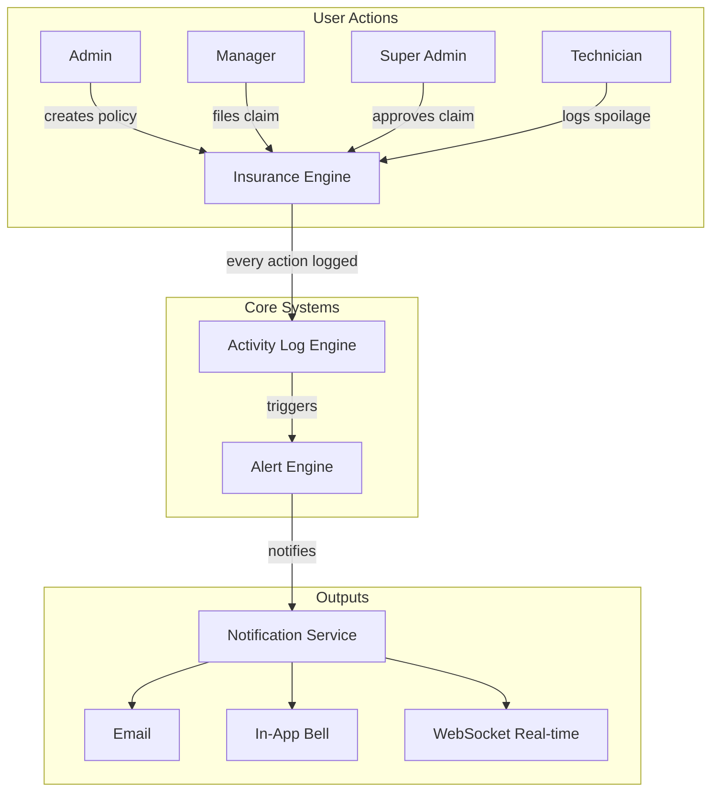

# GrainHero: Insurance + Logs + Alerts — End-to-End Implementation Plan

Three interconnected systems that form the **transparency backbone** of GrainHero. Every grain batch addition, deletion, spoilage event, insurance claim, payment, and system change will be logged, alerted on, and traceable.

---

## Architecture Overview



---

## User Review Required

> [!IMPORTANT]
> **Currency**: The existing insurance page uses PKR (Pakistani Rupee). Should we keep this or make it configurable per tenant?

> [!IMPORTANT]
> **Alert Retention**: Activity logs currently auto-delete after 1 year (TTL index). Should insurance-related logs be exempt from this? They may be needed for legal/compliance purposes.

> [!WARNING]
> **Breaking Change — Alert Model**: The current `Alert` model (4 fields: title, category, location, description) is too basic. We will migrate the alerts routes to use the comprehensive `GrainAlert` model which already has escalation, priorities, tenant scoping, and AI context. Old `/alerts/all-public` data will need migration.

---

## Open Questions

> [!IMPORTANT]
> **Super Admin Insurance Flow**: Currently super_admin creates policies. Should super_admin also be the one who approves/rejects claims, or should that be the tenant admin? The current model supports both — I'm proposing super_admin reviews, admin gets notified.

> [!NOTE]
> **Subscription Expiration Alerts**: You mentioned subscription expiration should be covered in alerts. Should these be daily checks (cron job) or real-time checks on login?

---

## Role Matrix — Who Does What

| Action | Super Admin | Admin | Manager | Technician |
|--------|:-----------:|:-----:|:-------:|:----------:|
| **Create Insurance Policy** | ✅ | ❌ (request only) | ❌ | ❌ |
| **Edit/Renew Policy** | ✅ | ❌ | ❌ | ❌ |
| **File Insurance Claim** | ✅ | ✅ | ✅ | ❌ |
| **Upload Claim Documents** | ✅ | ✅ | ✅ | ✅ |
| **Review/Investigate Claim** | ✅ | ❌ | ❌ | ❌ |
| **Approve/Reject Claim** | ✅ | ❌ | ❌ | ❌ |
| **Process Claim Payment** | ✅ | ❌ | ❌ | ❌ |
| **Log Spoilage Event** | ✅ | ✅ | ✅ | ✅ |
| **View Activity Logs** | ✅ (all tenants) | ✅ (own tenant) | ✅ (own tenant) | ✅ (batch/spoilage only) |
| **Export Logs (CSV/PDF)** | ✅ | ✅ | ✅ | ❌ |
| **View All Alerts** | ✅ (all tenants) | ✅ (own tenant) | ✅ (own tenant) | ✅ (assigned only) |
| **Acknowledge Alert** | ✅ | ✅ | ✅ | ✅ |
| **Resolve Alert** | ✅ | ✅ | ✅ | ✅ |
| **Escalate Alert** | ✅ | ✅ | ✅ | ❌ |
| **Configure Alert Rules** | ✅ | ✅ | ❌ | ❌ |

---

## Proposed Changes

### Phase 1: Backend — Insurance Workflow Completion

The backend models (`InsurancePolicy`, `InsuranceClaim`) are well-designed but the routes are **missing critical workflow endpoints**.

---

#### [MODIFY] [insurance.js](file:///c:/Users/shahe/GrainHero%20Startup/Grainhero/farmHomeBackend-main/routes/insurance.js)

Add **7 missing endpoints** for the full claim lifecycle:

```
POST   /claims/:id/review        — Super admin starts investigation
PUT    /claims/:id/status         — Update claim status (approve/reject/close)
POST   /claims/:id/documents      — Upload supporting documents (photos, reports)
PUT    /claims/:id/investigation   — Update investigation findings
PUT    /claims/:id/assessment      — Update damage assessment & settlement
POST   /claims/:id/payment         — Record payment processing
POST   /claims/:id/notes           — Add internal notes / communication log
DELETE /policies/:id               — Soft-delete a policy
PUT    /policies/:id/renew         — Renew an expired policy
```

Each endpoint will:
1. Validate role permissions
2. Execute the operation
3. Call `LoggingService` to create an activity log
4. Call `NotificationService` to notify relevant users
5. Optionally trigger an alert (for claim rejections, high-value approvals, etc.)

---

#### [MODIFY] [ActivityLog.js](file:///c:/Users/shahe/GrainHero%20Startup/Grainhero/farmHomeBackend-main/models/ActivityLog.js)

Add missing action enums to cover **every tiny detail**:

```js
// New actions to add:
'insurance_policy_renewed', 'insurance_policy_cancelled', 'insurance_policy_deleted',
'insurance_claim_reviewed', 'insurance_claim_approved', 'insurance_claim_rejected',
'insurance_claim_payment_processed', 'insurance_claim_document_uploaded',
'insurance_claim_escalated', 'insurance_claim_closed',
'silo_created', 'silo_updated', 'silo_deleted',
'sensor_configured', 'sensor_calibrated',
'user_created', 'user_updated', 'user_deleted', 'user_role_changed',
'subscription_created', 'subscription_renewed', 'subscription_expired', 'subscription_cancelled',
'threshold_updated', 'actuator_triggered',
'alert_acknowledged', 'alert_resolved', 'alert_escalated',
'report_exported', 'data_exported'
```

Add new categories:
```js
'silo', 'sensor', 'user', 'subscription', 'threshold', 'actuator', 'alert', 'export'
```

Add new entity types:
```js
'Silo', 'SensorDevice', 'Tenant', 'Subscription', 'Threshold', 'Actuator', 'GrainAlert'
```

---

#### [MODIFY] [loggingService.js](file:///c:/Users/shahe/GrainHero%20Startup/Grainhero/farmHomeBackend-main/services/loggingService.js)

Add **insurance lifecycle logging helpers** + alert auto-generation:

```js
// New helpers:
logInsurancePolicyCreated(user, policy, ip)
logInsurancePolicyUpdated(user, policy, changes, ip)
logInsurancePolicyRenewed(user, policy, ip)
logInsurancePolicyCancelled(user, policy, reason, ip)
logInsuranceClaimReviewed(user, claim, ip)
logInsuranceClaimApproved(user, claim, amount, ip)
logInsuranceClaimRejected(user, claim, reason, ip)
logInsuranceClaimPaymentProcessed(user, claim, payment, ip)
logInsuranceClaimDocumentUploaded(user, claim, document, ip)
logAlertAcknowledged(user, alert, ip)
logAlertResolved(user, alert, ip)
logAlertEscalated(user, alert, escalatedTo, ip)
logSubscriptionEvent(user, event, tenantId, ip)
logUserManagement(user, action, targetUser, ip)
logSettingsUpdated(user, settingType, changes, ip)
```

---

#### [NEW] [services/alertEngine.js](file:///c:/Users/shahe/GrainHero%20Startup/Grainhero/farmHomeBackend-main/services/alertEngine.js)

Central alert generation engine that creates `GrainAlert` records from system events:

```js
class AlertEngine {
  // Auto-generate alerts from activity logs
  static async processLogEntry(logEntry) { ... }
  
  // Scheduled checks (called by cron)
  static async checkSubscriptionExpirations() { ... }
  static async checkInsuranceRenewals() { ... }
  static async checkBatchQualityDegradation() { ... }
  static async checkOverduePayments() { ... }
  static async checkSensorOffline() { ... }
  
  // Alert creation with auto-notification
  static async createAlert({ tenant_id, title, message, priority, source, ... }) { ... }
}
```

**Alert triggers include:**
| Trigger | Priority | Roles Notified |
|---------|----------|----------------|
| Batch created | Low | Admin, Manager |
| Batch deleted | Critical | Admin, Super Admin |
| Spoilage event (high/critical) | Critical | Admin, Manager |
| Insurance claim filed | High | Super Admin |
| Insurance claim approved | Medium | Admin, Manager |
| Insurance claim rejected | High | Admin, Manager |
| Policy expiring in 30 days | High | Admin |
| Policy expiring in 7 days | Critical | Admin, Super Admin |
| Subscription expiring in 7 days | Critical | Admin |
| Subscription expired | Critical | Admin, Super Admin |
| Payment overdue > 30 days | High | Admin |
| Sensor offline > 1 hour | High | Technician, Manager |
| Batch risk score > 80% | Critical | Admin, Manager |
| User login from new IP | Medium | Admin |
| Settings changed | Low | Admin |
| Large batch dispatch (> 5000kg) | Medium | Admin |
| Batch quantity modified | High | Admin, Manager |

---

#### [MODIFY] [GrainAlert.js](file:///c:/Users/shahe/GrainHero%20Startup/Grainhero/farmHomeBackend-main/models/GrainAlert.js)

Add new source types and make `silo_id` optional (some alerts like subscription expiry aren't silo-related):

```js
source: {
  type: String,
  enum: ['sensor', 'ai', 'manual', 'system', 'threshold', 'insurance', 'subscription', 'batch', 'payment', 'user'],
  required: true
}

// Make silo_id optional
silo_id: {
  type: mongoose.Schema.Types.ObjectId,
  ref: 'Silo',
  index: true
  // Remove required
}
```

---

#### [MODIFY] [alerts.js (routes)](file:///c:/Users/shahe/GrainHero%20Startup/Grainhero/farmHomeBackend-main/routes/alerts.js)

**Complete rewrite** to use `GrainAlert` model with tenant-scoped, role-based access:

```
GET    /grain-alerts              — List alerts (role-filtered, paginated)
GET    /grain-alerts/:id          — Get alert detail
POST   /grain-alerts/:id/acknowledge  — Acknowledge alert
POST   /grain-alerts/:id/resolve      — Resolve alert  
POST   /grain-alerts/:id/escalate     — Escalate to higher role
GET    /grain-alerts/statistics        — Alert stats (counts by priority, avg response time)
GET    /grain-alerts/unread-count      — Quick count for bell icon badge
PUT    /grain-alerts/:id/assign        — Assign alert to user
```

---

#### [MODIFY] [activityLogs.js (routes)](file:///c:/Users/shahe/GrainHero%20Startup/Grainhero/farmHomeBackend-main/routes/activityLogs.js)

Add new endpoints:

```
GET    /activity-logs/entity/:type/:id  — All logs for a specific entity
GET    /activity-logs/export            — Export logs as CSV
GET    /activity-logs/user/:userId      — Logs by specific user
GET    /activity-logs/timeline/:batchId — Full batch lifecycle timeline
```

---

#### Integrate Logging Into Existing Routes

Add `LoggingService` calls to these existing route files that currently **don't log anything**:

| Route File | Actions to Log |
|-----------|----------------|
| [insurance.js](file:///c:/Users/shahe/GrainHero%20Startup/Grainhero/farmHomeBackend-main/routes/insurance.js) | Policy CRUD, claim CRUD, all status changes |
| [silos.js](file:///c:/Users/shahe/GrainHero%20Startup/Grainhero/farmHomeBackend-main/routes/silos.js) | Silo create/update/delete |
| [sensors.js](file:///c:/Users/shahe/GrainHero%20Startup/Grainhero/farmHomeBackend-main/routes/sensors.js) | Sensor configure/calibrate |
| [userManagement.js](file:///c:/Users/shahe/GrainHero%20Startup/Grainhero/farmHomeBackend-main/routes/userManagement.js) | User CRUD, role changes |
| [tenantSettings.js](file:///c:/Users/shahe/GrainHero%20Startup/Grainhero/farmHomeBackend-main/routes/tenantSettings.js) | Settings updates |

---

### Phase 2: Frontend — Insurance Workflow UI

---

#### [MODIFY] [insurance/page.tsx](file:///c:/Users/shahe/GrainHero%20Startup/Grainhero/farmHomeFrontend-main/app/%5Blocale%5D/%28authenticated%29/insurance/page.tsx)

**Major upgrade** — Transform from a single-view page to a role-aware insurance command center:

**For Admin/Manager (claim filers):**
- Keep existing: Overview, Spoilage Events, Claims & Exports, Batch Reports, Timeline, Policies tabs
- **NEW**: Claim detail drawer/modal with status stepper showing:
  ```
  Filed → Under Review → Investigation → Assessment → Approved/Rejected → Payment → Closed
  ```
- **NEW**: Communication log viewer (messages between admin and super_admin)
- **NEW**: Document gallery for each claim (photos, reports, PDFs)
- **ENHANCE**: Real-time claim status updates

**For Super Admin (claim reviewer):**
- **NEW Tab**: "Review Queue" — all pending claims across tenants with:
  - Claim cards with priority indicators
  - Quick approve/reject actions
  - Investigation form (findings, cause of loss, preventability)
  - Assessment form (damage assessment, repair estimate, settlement amount)
  - Payment processing form (method, reference, amount)
  - Internal notes section
- **NEW Tab**: "Policy Management" — full CRUD for policies
  - Create policy form with batch selection
  - Renew/cancel policy actions
  - Risk factor editor
  - Premium calculator

---

### Phase 3: Frontend — Activity Logs Upgrade

---

#### [MODIFY] [activity-logs/page.tsx](file:///c:/Users/shahe/GrainHero%20Startup/Grainhero/farmHomeFrontend-main/app/%5Blocale%5D/%28authenticated%29/activity-logs/page.tsx)

**Enhancements:**

1. **Visual Timeline Mode** — Toggle between list and timeline view
   - Connected vertical line with colored nodes per severity
   - Expandable metadata cards
   - Photo thumbnails for spoilage events

2. **Entity Deep-Dive** — Click any entity reference to see its full history:
   - "Show all logs for batch WB-001-2026" → filtered timeline
   - "Show all logs for claim CLM-2026-001" → claim lifecycle

3. **Export Controls**
   - Export filtered logs as CSV
   - Export as PDF report (uses existing pdfService)

4. **Live Indicator**
   - Pulsing dot when new logs arrive
   - Auto-refresh toggle (every 30s)

5. **Category Summary Bar**
   - Show ALL categories (currently shows only 4)
   - Clickable cards to filter
   - Mini sparkline charts for activity trends

6. **Role-Aware Views**
   - Technician sees: batch, spoilage, sensor only
   - Manager sees: all grain-related
   - Admin sees: everything for their tenant
   - Super Admin sees: cross-tenant with tenant selector

---

### Phase 4: Frontend — Alerts System Overhaul

---

#### [MODIFY] [grain-alerts/page.tsx](file:///c:/Users/shahe/GrainHero%20Startup/Grainhero/farmHomeFrontend-main/app/%5Blocale%5D/%28authenticated%29/grain-alerts/page.tsx)

**Complete rewrite** from basic table to professional alert management center:

1. **Alert Dashboard**
   - Priority distribution chart (critical/high/medium/low)
   - Average response time metric
   - Resolution rate
   - Unresolved count with aging indicators

2. **Alert Feed** — Real-time feed with:
   - Color-coded priority cards (red flash for critical)
   - Source icon (sensor, AI, system, insurance, subscription)
   - One-click acknowledge/resolve
   - Escalation button (select user + reason)
   - Time-since-triggered counter

3. **Alert Detail Panel**
   - Full alert info with trigger conditions
   - Action history (who acknowledged, when resolved)
   - Escalation chain
   - Related alerts (duplicate detection)
   - Linked entity (batch, silo, claim) with quick-nav

4. **Alert Types Covered**:
   - 🌡️ Sensor threshold breaches
   - 🤖 AI risk predictions
   - 🛡️ Insurance: policy expiring, claim filed/approved/rejected
   - 📦 Batch: created, deleted, dispatched, spoilage detected
   - 💰 Payment: overdue, received
   - 🔑 Subscription: expiring, expired
   - 👤 User: new login, role change
   - ⚙️ System: settings changed, sensor offline

5. **Alert Preferences** (for admin)
   - Toggle which alert types generate notifications
   - Email notification preferences
   - Escalation timeout rules

---

### Phase 5: Sidebar Navigation Update

---

#### [MODIFY] [sidebar.tsx](file:///c:/Users/shahe/GrainHero%20Startup/Grainhero/farmHomeFrontend-main/components/sidebar.tsx)

Update navigation to include the enhanced pages with proper role gating and badge counts:

- Activity Logs → show unread log count badge
- Grain Alerts → show **unresolved alert count** as a live badge (red for critical)
- Insurance → show pending claims count

---

## Implementation Order

```mermaid
gantt
    title Implementation Phases
    dateFormat  X
    axisFormat %s
    
    section Phase 1 - Backend
    ActivityLog model enums      :a1, 0, 1
    LoggingService helpers       :a2, 1, 2
    AlertEngine service          :a3, 2, 4
    Insurance routes (7 new)     :a4, 2, 5
    GrainAlert model updates     :a5, 4, 5
    Alerts routes rewrite        :a6, 5, 7
    Activity log routes (new)    :a7, 5, 6
    Integrate logging into routes:a8, 7, 9
    
    section Phase 2 - Frontend Insurance
    Super Admin review queue     :b1, 9, 12
    Claim detail with stepper    :b2, 9, 11
    Policy management CRUD       :b3, 11, 13
    
    section Phase 3 - Frontend Logs
    Enhanced log timeline        :c1, 13, 15
    Entity deep-dive             :c2, 13, 14
    Export CSV/PDF               :c3, 14, 15
    
    section Phase 4 - Frontend Alerts
    Alert dashboard              :d1, 15, 17
    Real-time alert feed         :d2, 15, 17
    Alert detail + escalation    :d3, 17, 18
    Alert preferences            :d4, 18, 19
    
    section Phase 5 - Polish
    Sidebar badge counts         :e1, 19, 20
    Cross-system integration test:e2, 20, 21
```



---

## Verification Plan

### Automated Tests
- `npm run build` — Ensure no TypeScript/compilation errors
- Test each new API endpoint via curl/Postman
- Verify role-based access: each endpoint tested with super_admin, admin, manager, technician tokens

### Manual Verification
1. **Insurance E2E Flow**:
   - Super admin creates a policy → log created → admin notified
   - Manager files a claim with photos → log created → super admin alerted
   - Super admin reviews → adds investigation → approves → processes payment
   - Each step verified in activity logs and alerts
   
2. **Logs Transparency**:
   - Create a batch → verify log entry appears with metadata
   - Delete a batch → verify CRITICAL severity log + alert generated
   - Check that technician can only see batch/spoilage logs
   
3. **Alerts**:
   - Trigger a sensor threshold breach → verify alert appears in real-time
   - File an insurance claim → verify alert appears for super admin
   - Let a subscription near expiration → verify alert fires
   - Acknowledge and resolve alerts → verify log trail

### Browser Testing
- Test insurance page at each role (login as super_admin, admin, manager, technician)
- Test mobile responsiveness on all three pages
- Verify alert badge updates in sidebar

---

## File Summary

| Category | New Files | Modified Files |
|----------|:---------:|:--------------:|
| Backend Models | 0 | 2 (ActivityLog, GrainAlert) |
| Backend Routes | 0 | 4 (insurance, alerts, activityLogs, + integration into 5 existing routes) |
| Backend Services | 1 (alertEngine) | 1 (loggingService) |
| Frontend Pages | 0 | 3 (insurance, activity-logs, grain-alerts) |
| Frontend Components | 0 | 1 (sidebar) |
| **Total** | **1** | **11+** |

> [!TIP]
> This plan is designed to be **incremental** — each phase builds on the previous one and the system remains functional between phases. We can ship Phase 1+2 (insurance) independently of Phase 3+4 (logs+alerts).
